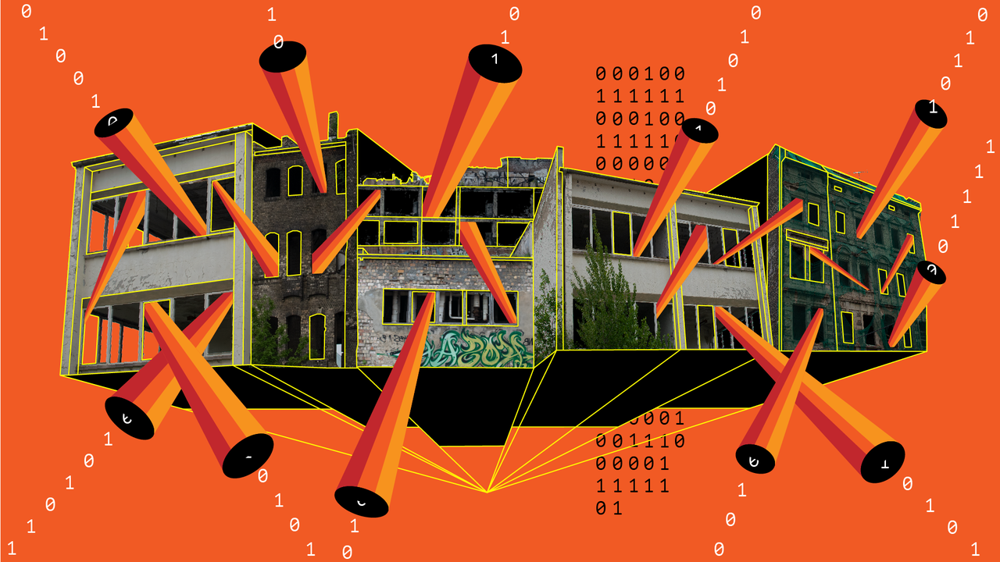
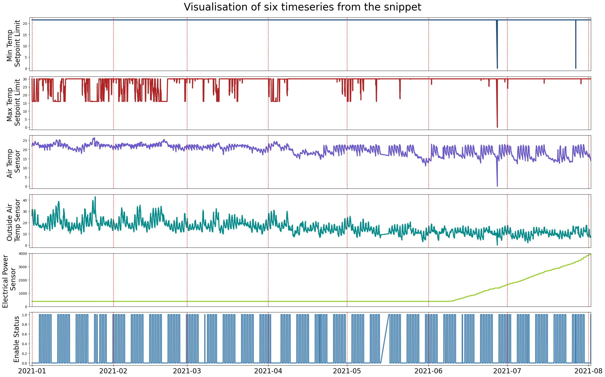

# BTS: Building Timeseries Dataset



<a href="https://www.instagram.com/miss.tonton/">Anton Grabolle</a> / <a href="https://www.betterimagesofai.org">Better Images of AI</a> / AI Architecture / <a href="https://creativecommons.org/licenses/by/4.0/">Licenced by CC-BY 4.0</a></span>

**BTS: Building Timeseries Dataset: Empowering Large-Scale Building Analytics**.

[[ArXiv](https://arxiv.org/abs/2406.08990)]
[[OpenReview](https://openreview.net/forum?id=6cCFK69vJI)]
[[NeurIPS](https://neurips.cc/virtual/2024/poster/97839)]
[[Slides](2024_12_09_BTS_NeurIPS_slides.pdf)]
[[Poster](2024_12_09_BTS_NeurIPS_Poster.pdf)]


The Building TimeSeries (BTS) dataset covers three buildings over a three-year period, comprising more than ten thousand timeseries data points with hundreds of unique ontologies.
Moreover, the metadata is standardized using the Brick schema. Scroll down to the [Access Section](#access) to download.

This is the official repository of our [NeurIPS 2024](https://neurips.cc/virtual/2024/poster/97839) DB Track paper that present this dataset.

**Acknowledgement**:
This is part of the NSW, Australia [Digital Infrastructure Energy Flexibility (DIEF)](https://research.csiro.au/dch/projects/nsw-dief/) project.

# Abstract

Buildings play a crucial role in human well-being, influencing occupant comfort, health, and safety.
Additionally, they contribute significantly to global energy consumption, accounting for one-third of total energy usage, and carbon emissions.
Optimizing building performance presents a vital opportunity to combat climate change and promote human flourishing.
However, research in building analytics has been hampered by the lack of accessible, available, and comprehensive real-world datasets on multiple building operations.
In this paper, we introduce the Building TimeSeries (BTS) dataset.
Our dataset covers three buildings over a three-year period, comprising more than ten thousand timeseries data points with hundreds of unique ontologies.
Moreover, the metadata is standardized using the Brick schema.
To demonstrate the utility of this dataset, we performed benchmarks on two tasks: timeseries ontology classification and zero-shot forecasting.
These tasks represent an essential initial step in addressing challenges related to interoperability in building analytics.
Access to the dataset and the code used for benchmarking are available here: https://github.com/cruiseresearchgroup/DIEF_BTS


# Dataset

View the [data card](https://sites.research.google/datacardsplaybook/) [here](BTS_DataCards.md).

## Snippet



For ease, we provided a very small snippet of the dataset: `DIEF_B_Snippet50_3weeks.pkl.zip`.
Only 50 timeseries, all from `Site B`, haphazardly selected.
This file is less than 10 MB, small enough to be sent as email attachment in most system.
Accompanied with it is a short code to extract and visualize the dataset: `DIEF_inspect_Snippet.ipynb`.

We also provided the building metadata `Site_B.ttl` in the form of a [Brick](https://brickschema.org/ontology/1.2) [turtle](https://www.w3.org/TR/turtle/) file.
Accompanied with it is a Brick definition file `Brick_v1.2.1.ttl` and a short code to extract the statistics: `DIEF_inspect_brick.ipynb`.
If you have not, you will need to install the [rdflib](https://rdflib.readthedocs.io) python package.


## Access

Access the raw dataset on [FigShare](https://figshare.com/articles/dataset/BTS_Building_Timeseries_Dataset_Raw/28705559); DOI: `10.6084/m9.figshare.28705559`.

A train only sub-dataset partition was made available at an earlier time for the submission to peer-review.
Access it on [FigShare](https://figshare.com/articles/dataset/BTS_Building_Timeseries_Dataset_Empowering_Large-Scale_Building_Analytics_TRAIN_ONLY_/25912180). 

### Files description

List of files available now:
* `Site_A_metadata.csv`, `Site_B_metadata.csv`, and `Site_C_metadata.csv` are the timeseries metadata file containing basic statistics as well as the brick class. Treat the `StreamID` column as the primary key. You can use spreadsheet or pandas to inspect the file.
* `Site_Aaa.zip`, `Site_Baa.zip`, and `Site_Aaa.zip` are the raw time series data. Each is a zip of a folder of [`pickle`](https://docs.python.org/3/library/pickle.html) files. Inside each pickle file is a list containing: a string of `StreamID`, a 1D NumPy array of timestamps, and another 1D NumPy array of value. You can use the `DIEF_inspect_raw.ipynb` to inspect these files.
* `Site_A.ttl`, `Site_B.ttl`, and `Site_C.ttl` are the [turtle](https://www.w3.org/TR/turtle/) files that contains the metadata of each buildings using the [Brick schema](https://brickschema.org). Use the `StreamID` to match the nodes in this graph with the timeseries. You can use `DIEF_inspect_brick.ipynb` to inspect these files.


The following files are missing and it is intentional:
* `Site_Aaa/5765.pickle`
* `Site_Aaa/7558.pickle`
* `Site_Aaa/3973.pickle`
* `Site_Aaa/4445.pickle`

Not all StreamID has a file.


# Code


The `20240530_class_code` folder contains the code to reproduce the classification results.
Here is a short description of each file:

* `requirement.txt` **is coming**, but all the information are already available in `e12_pbs_py.sh.o116050675`.
* `xySplit.py` Use this to split `train.zip` to `train_X.zip` and `train_Y.csv`.
* `e05_naieve_02.ipynb` Run this notebook to get the naive results.
* `e07_02_LR.ipynb` Run this notebook to get the Logistic Regression results.
* `e08_02_RF.ipynb` Run this notebook to get the Random Forest results.
* `e09_01_XGBoost.ipynb` Run this notebook to get the XGBoost results.
* `thuml_tslib_dief` This folder contains the **modified** library from Tsinghua University Machine Learning Group's library: https://github.com/thuml/Time-Series-Library
* `e12_pbs_py.sh` This is the setup to run the `Transformer` model. Consider this as the **main** function.
* `e12_pbs_py.sh.o116050675` This is the output of the above setup. It contains detailed information about installed Python packages, their version, as well as the hardware specifications.
* `e13_pbs_py.sh` `DLinear`
* `e15_pbs_py.sh` `PatchTST`
* `e17_pbs_py.sh` `Informer`

The `zeroshot_preprocess` folder contains the code to preprocess the zero-shot forecasting data. Run `zeroshot_preprocess/SiteA_preprocessing.ipynb` to generate the processed `BTS_A` data. 
* Note that, as of now, only the training data for the classification benchmark are made publicly available as we are planning to host a competition using this dataset. None of the data for the zero-shot forecasting benchmark are made available as of now. (Last update 2024 06 12)
  
The `20240612_zeroshot_code` folder contains the code to reproduce the zero-shot forecasting results. This folder is a **modified** library from Tsinghua University Machine Learning Group's library: https://github.com/thuml/Time-Series-Library

* The zero-shot forecasting task shares the same `requirement.txt` as the classification task. 
* `./scripts/sample_DLinear.sh` is a sample script that trains a DLinear on `BTS_A` and tests on `BTS_B` and `BTS_C`. To run the code, replace the argument `data_path` with your own data path
* To train alternative models, replace the `model_name` with the target model name that is implemented in `./model` directory and change the corresponding configurations

The `e20_longTail` folder contains the code to reproduce the figures in Appendix B.


# Brick by Brick: Automating Building Data Classification Challenge


This dataset is used as a part of the following competition: https://www.aicrowd.com/challenges/brick-by-brick-2024

A global challenge to automate building data classification, unlocking more intelligent, energy-efficient buildings for a sustainable future.

Buildings are one of the biggest energy consumers in the modern world, making energy efficiency essential. However, managing building systems data across different buildings is time-intensive and costly due to inconsistent data formats. This challenge invites you to transform building management by creating a solution that classifies building data automatically, promoting standardised, energy-efficient management for a more sustainable world.

Relevant starter kit code for the competitions are avaiable here: [`/competition1`](/competition1)


# Citation

```
Arian Prabowo, Xiachong Lin, Imran Razzak, Hao Xue, Emily W. Yap, Matthew Amos, Flora D. Salim. BTS: Building Timeseries Dataset: Empowering Large-Scale Building Analytics, 2024. arXiv:2406.08990. https://doi.org/10.48550/arXiv.2406.08990.
```

BibTeX:
The [NeurIPS 2024] paper
```
@inproceedings{prabowo2024bts,
      title={BTS: Building Timeseries Dataset: Empowering Large-Scale Building Analytics},
      author={Arian Prabowo and Xiachong Lin and Imran Razzak and Hao Xue and Emily W. Yap and Matthew Amos and Flora D. Salim},
      year={2024},
      booktitle={The Thirty-eight Conference on Neural Information Processing Systems Datasets and Benchmarks Track},
      url={https://openreview.net/forum?id=6cCFK69vJI}
}

```

The dataset
```
@article{prabowo2024btsTrain,
    author = "Arian Prabowo and Xiachong Lin and Imran Razzak and Hao Xue and Emily Yap and Matthew Amos and Flora Salim",
    title = "{BTS: Building Timeseries Dataset: Empowering Large-Scale Building Analytics (TRAIN ONLY)}",
    year = "2024",
    month = "6",
    url = "https://figshare.com/articles/dataset/BTS_Building_Timeseries_Dataset_Empowering_Large-Scale_Building_Analytics_TRAIN_ONLY_/25912180",
    doi = "10.6084/m9.figshare.25912180.v1"
}
```

# Misc

* Contact for this code repo: https://www.arianprabowo.com/
* Similar dataset: [LBNL Building 59](https://datadryad.org/stash/dataset/doi:10.7941/D1N33Q) A three-year building operational performance dataset for informing energy efficiency
* Similar dataset: [Mortar](https://mortardata.org/) (Access is currently restricted. Last update:2024 08 19)
* Other buildings related dataset: [Building Data Genome Directory](https://buds-lab-building-data-directory-meta-directory-s0imdd.streamlit.app/)
* Learn more about building analytics and data-driven smart buildings from [IEA EBC Annex 81](https://annex81.iea-ebc.org/).

